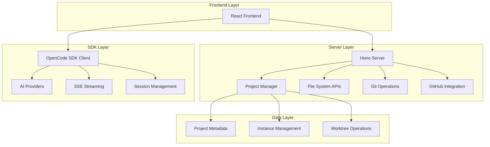
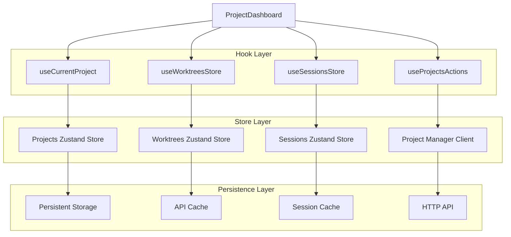

# OpenCode Web UI - API Integration Patterns & Project Dashboard

## 1. API Integration Architecture Overview

The OpenCode Web UI implements a sophisticated API integration pattern that combines direct SDK communication with a custom Hono server for project management. This hybrid approach provides both the flexibility of direct AI provider access and the control needed for multi-project management.

### 1.1 Integration Architecture Diagram



### 1.2 API Communication Patterns

| Component | Communication Method | Purpose |
|-----------|---------------------|----------|
| Project Management | HTTP REST API | CRUD operations, instance control |
| AI Chat | OpenCode SDK + SSE | Real-time AI interactions |
| File Operations | HTTP REST API | File system access, directory listing |
| Git Operations | HTTP REST API + Git CLI | Version control operations |
| GitHub Integration | HTTP REST API + GitHub CLI | Repository integration |

## 2. Project Management API Specification

### 2.1 Core Project Endpoints

#### Get All Projects
```http
GET /api/projects
Content-Type: application/json
```

**Response:**
```typescript
interface Project {
  id: string
  name: string
  path: string
  type: "git" | "local"
  addedAt: string
  lastOpened: string | null
  instance?: ProjectInstance
  worktrees?: Worktree[]
}

type Response = Project[]
```

#### Create New Project
```http
POST /api/projects
Content-Type: application/json

{
  "path": "/path/to/project",
  "name": "Optional Project Name"
}
```

**Response:**
```typescript
interface CreateProjectResponse extends Project {
  metadata?: {
    packageJson?: Record<string, unknown>
    gitInfo?: {
      branch: string
      remotes: string[]
    }
  }
}
```

#### Project Instance Management
```http
# Start project instance
POST /api/projects/{id}/start

# Stop project instance  
POST /api/projects/{id}/stop

# Get instance status
GET /api/projects/{id}/status
```

**Instance Response:**
```typescript
interface ProjectInstance {
  id: string
  port: number
  status: "starting" | "running" | "stopped" | "error"
  startedAt: Date
  url?: string // Backend URL when running
}
```

### 2.2 Worktree Management API

#### List Project Worktrees
```http
GET /api/projects/{id}/worktrees
```

**Response:**
```typescript
interface Worktree {
  id: string
  title: string
  path: string
  relativePath: string
  branch?: string
  head?: string
  isPrimary: boolean
  isDetached: boolean
  isLocked: boolean
  lockReason?: string
}

type WorktreesResponse = Worktree[]
```

#### Create New Worktree
```http
POST /api/projects/{id}/worktrees
Content-Type: application/json

{
  "path": "/path/to/worktree",
  "title": "Feature Branch",
  "branch": "feature/new-feature",
  "baseRef": "main",
  "createBranch": true
}
```

### 2.3 System Integration APIs

#### File System Operations
```http
# Get home directory
GET /api/system/home

# List directory contents
GET /api/system/list-directory?path={encodedPath}

# Get package.json info
GET /api/system/package-json?path={encodedPath}
```

**Directory Listing Response:**
```typescript
interface DirectoryEntry {
  name: string
  path: string
  isDirectory: boolean
}

interface DirectoryListingResponse {
  path: string
  parent: string | null
  entries: DirectoryEntry[]
}
```

#### Git Integration
```http
# Get Git summary
GET /api/projects/{id}/git/summary?worktree={worktreeId}

# Get commit history
GET /api/projects/{id}/git/commits?worktree={worktreeId}&limit=10

# Get branch information
GET /api/projects/{id}/git/branches?worktree={worktreeId}
```

**Git Summary Response:**
```typescript
interface GitSummary {
  branch: string
  status: {
    staged: number
    unstaged: number
    untracked: number
  }
  lastCommit?: {
    hash: string
    message: string
    author: string
    date: string
  }
  recentCommits?: Array<{
    hash: string
    message: string
    author: string
    date: string
  }>
}
```

## 3. OpenCode SDK Integration Patterns

### 3.1 SDK Client Lifecycle

```typescript
// SDK service for client management
class OpencodeSDKService {
  private clients = new Map<string, OpencodeClient>()
  private instances = new Map<string, ProjectInstance>()
  
  async getClient(projectId: string, projectPath: string): Promise<OpencodeClient> {
    // Check existing client
    const existing = this.clients.get(projectId)
    if (existing) return existing
    
    // Ensure project instance is running
    const instance = await this.ensureInstance(projectId, projectPath)
    
    // Create SDK client
    const client = new OpencodeClient({
      baseURL: instance.url,
      projectPath: projectPath
    })
    
    this.clients.set(projectId, client)
    return client
  }
  
  private async ensureInstance(projectId: string, projectPath: string): Promise<ProjectInstance> {
    const existing = this.instances.get(projectId)
    if (existing?.status === 'running') return existing
    
    // Start new instance via project manager
    const response = await fetch(`/api/projects/${projectId}/start`, {
      method: 'POST'
    })
    
    const instance = await response.json()
    this.instances.set(projectId, instance)
    return instance
  }
}
```

### 3.2 Provider and Model Management

```typescript
// Provider selection hook
export function useProvidersSDK(
  projectId: string | undefined,
  projectPath: string | undefined,
  instanceStatus: string
) {
  const [providers, setProviders] = useState<Provider[]>([])
  const [selectedProvider, setSelectedProvider] = useState<string>('')
  const [selectedModel, setSelectedModel] = useState<string>('')
  const [availableModels, setAvailableModels] = useState<Model[]>([])
  
  // Load providers when SDK is ready
  useEffect(() => {
    if (!client || instanceStatus !== 'running') return
    
    const loadProviders = async () => {
      try {
        const response = await client.provider.list()
        setProviders(response.data || [])
        
        // Auto-select first provider if none selected
        if (!selectedProvider && response.data?.length > 0) {
          setSelectedProvider(response.data[0].id)
        }
      } catch (error) {
        console.error('Failed to load providers:', error)
      }
    }
    
    loadProviders()
  }, [client, instanceStatus])
  
  // Load models when provider changes
  useEffect(() => {
    if (!client || !selectedProvider) return
    
    const loadModels = async () => {
      try {
        const response = await client.provider.models({
          path: { id: selectedProvider }
        })
        setAvailableModels(response.data || [])
        
        // Auto-select first model if none selected
        if (!selectedModel && response.data?.length > 0) {
          setSelectedModel(response.data[0].id)
        }
      } catch (error) {
        console.error('Failed to load models:', error)
      }
    }
    
    loadModels()
  }, [client, selectedProvider])
  
  return {
    providers,
    selectedProvider,
    selectedModel,
    availableModels,
    setSelectedProvider,
    setSelectedModel
  }
}
```

### 3.3 Session Management Integration

```typescript
// Session management with worktree awareness
export function useSessionsSDK(
  projectId: string | undefined,
  projectPath: string | undefined,
  sessionId: string | undefined,
  instanceStatus: string,
  onSessionChange: () => Promise<void>,
  worktreeId: string = 'default'
) {
  const [sessions, setSessions] = useState<SessionInfo[]>([])
  const [currentSession, setCurrentSession] = useState<SessionInfo | null>(null)
  const [isLoading, setIsLoading] = useState(false)
  
  // Load sessions for current worktree
  const loadSessions = useCallback(async () => {
    if (!client || !projectPath) return
    
    setIsLoading(true)
    try {
      const response = await client.session.list({
        query: { 
          directory: projectPath,
          worktree: worktreeId 
        }
      })
      
      const sessionList = response.data || []
      setSessions(sessionList)
      
      // Find current session
      if (sessionId) {
        const current = sessionList.find(s => s.id === sessionId)
        setCurrentSession(current || null)
      }
    } catch (error) {
      console.error('Failed to load sessions:', error)
    } finally {
      setIsLoading(false)
    }
  }, [client, projectPath, sessionId, worktreeId])
  
  // Create new session
  const handleCreateSession = useCallback(async (title?: string) => {
    if (!client || !projectPath) return null
    
    try {
      const response = await client.session.create({
        body: {
          title: title || `New Session ${Date.now()}`,
          directory: projectPath,
          worktree: worktreeId
        }
      })
      
      const newSession = response.data
      if (newSession) {
        setSessions(prev => [newSession, ...prev])
        await onSessionChange()
        return newSession
      }
    } catch (error) {
      console.error('Failed to create session:', error)
    }
    return null
  }, [client, projectPath, worktreeId, onSessionChange])
  
  return {
    sessions,
    currentSession,
    isLoading,
    loadSessions,
    handleCreateSession,
    handleRenameSession,
    handleDeleteSession
  }
}
```

## 4. Project Dashboard Implementation Details

### 4.1 Dashboard State Management Architecture



### 4.2 Dashboard Data Flow

```typescript
// Dashboard component with comprehensive state management
export default function ProjectDashboard() {
  const { projectId, worktreeId } = useParams()
  const navigate = useNavigate()
  
  // Core state hooks
  const currentProject = useCurrentProject()
  const { loadWorktrees, createWorktree, removeWorktree } = useWorktreesStore()
  const { loadSessions, createSession } = useSessionsStore()
  const { selectProject } = useProjectsActions()
  
  // Derived state
  const worktrees = useWorktreesForProject(projectId || '')
  const sessions = useSessionsForProject(projectId || '', activeWorktreePath)
  const recentSessions = useRecentSessions(projectId || '', 5, activeWorktreePath)
  
  // Local state for dashboard-specific data
  const [gitStatus, setGitStatus] = useState<GitSummary | null>(null)
  const [agentSummary, setAgentSummary] = useState<AgentSummary | null>(null)
  const [activityFeed, setActivityFeed] = useState<ActivityEvent[]>([])
  
  // Active worktree resolution
  const activeWorktree = useMemo(() => {
    if (!projectId) return undefined
    
    if (resolvedWorktreeId === 'default') {
      return {
        id: 'default',
        path: currentProject?.path,
        title: `${currentProject?.name ?? 'Project'} (default)`
      }
    }
    
    return worktrees.find(worktree => worktree.id === resolvedWorktreeId)
  }, [projectId, resolvedWorktreeId, currentProject, worktrees])
  
  // Data loading effects
  useEffect(() => {
    if (!projectId) return
    
    // Parallel data loading
    Promise.all([
      loadWorktrees(projectId),
      loadSessions(projectId, activeWorktreePath),
      loadGitSummary()
    ]).catch(error => {
      console.error('Dashboard initialization failed:', error)
    })
  }, [projectId, activeWorktreePath])
  
  // Git status loading
  const loadGitSummary = useCallback(async () => {
    if (!projectId || !activeWorktreePath) return
    
    try {
      const summary = await fetchGitSummary(projectId, resolvedWorktreeId)
      setGitStatus(summary)
    } catch (error) {
      console.error('Git summary loading failed:', error)
      setGitStatus(null)
    }
  }, [projectId, activeWorktreePath, resolvedWorktreeId])
  
  // Activity feed generation
  const activityFeed = useMemo(() => {
    const events: ActivityEvent[] = []
    
    // Session events
    recentSessions.forEach(session => {
      events.push({
        id: `session-${session.id}`,
        type: 'session_created',
        message: `New chat session: ${session.title}`,
        timestamp: session.createdAt
      })
    })
    
    // Git events
    gitStatus?.recentCommits?.forEach(commit => {
      events.push({
        id: `commit-${commit.hash}`,
        type: 'git_commit',
        message: commit.message,
        timestamp: commit.date
      })
    })
    
    return events
      .sort((a, b) => new Date(b.timestamp).getTime() - new Date(a.timestamp).getTime())
      .slice(0, 10)
  }, [recentSessions, gitStatus])
  
  return (
    <div className="space-y-6">
      <ProjectOverviewCard project={currentProject} />
      <WorktreeManagementCard 
        worktrees={sortedWorktrees}
        activeWorktree={activeWorktree}
        onSelectWorktree={handleSelectWorktree}
        onCreateWorktree={handleCreateWorktree}
      />
      <SessionSummaryCard 
        sessions={sessions}
        recentSessions={recentSessions}
        onCreateSession={handleCreateSession}
      />
      <GitStatusCard gitStatus={gitStatus} />
      <ActivityFeedCard activities={activityFeed} />
    </div>
  )
}
```

### 4.3 Worktree Management Implementation

```typescript
// Worktree store with Git integration
export const useWorktreesStore = create<WorktreesStore>()(
  immer((set, get) => ({
    worktreesByProject: {},
    loading: {},
    error: {},
    
    loadWorktrees: async (projectId: string) => {
      set(state => {
        state.loading[projectId] = true
        state.error[projectId] = null
      })
      
      try {
        const client = await getProjectClient()
        const worktrees = await client.getWorktrees(projectId)
        
        set(state => {
          state.worktreesByProject[projectId] = worktrees
          state.loading[projectId] = false
        })
      } catch (error) {
        set(state => {
          state.error[projectId] = error instanceof Error ? error.message : 'Unknown error'
          state.loading[projectId] = false
        })
      }
    },
    
    createWorktree: async (projectId: string, params: CreateWorktreeParams) => {
      try {
        const client = await getProjectClient()
        const newWorktree = await client.createWorktree(projectId, params)
        
        set(state => {
          const existing = state.worktreesByProject[projectId] || []
          state.worktreesByProject[projectId] = [...existing, newWorktree]
        })
        
        return newWorktree
      } catch (error) {
        throw error instanceof Error ? error : new Error('Failed to create worktree')
      }
    },
    
    removeWorktree: async (projectId: string, worktreeId: string) => {
      try {
        const client = await getProjectClient()
        await client.removeWorktree(projectId, worktreeId)
        
        set(state => {
          const existing = state.worktreesByProject[projectId] || []
          state.worktreesByProject[projectId] = existing.filter(w => w.id !== worktreeId)
        })
      } catch (error) {
        throw error instanceof Error ? error : new Error('Failed to remove worktree')
      }
    }
  }))
)
```

### 4.4 Dashboard Performance Optimizations

#### Selective Re-rendering

```typescript
// Memoized dashboard cards to prevent unnecessary re-renders
const ProjectOverviewCard = React.memo(({ project }: { project: Project | null }) => {
  if (!project) return <ProjectOverviewSkeleton />
  
  return (
    <Card>
      <CardHeader>
        <CardTitle className="flex items-center gap-2">
          <FolderOpen className="h-5 w-5" />
          {project.name}
        </CardTitle>
        <CardDescription>{project.path}</CardDescription>
      </CardHeader>
      <CardContent>
        <div className="grid grid-cols-2 gap-4">
          <div>
            <Label>Type</Label>
            <Badge variant={project.type === 'git' ? 'default' : 'secondary'}>
              {project.type}
            </Badge>
          </div>
          <div>
            <Label>Last Opened</Label>
            <p className="text-sm text-muted-foreground">
              {project.lastOpened 
                ? formatRelativeTime(project.lastOpened)
                : 'Never'
              }
            </p>
          </div>
        </div>
      </CardContent>
    </Card>
  )
})
```

#### Efficient Data Loading

```typescript
// Debounced and cached data loading
const useDebouncedGitStatus = (projectId: string, worktreeId: string, delay = 1000) => {
  const [gitStatus, setGitStatus] = useState<GitSummary | null>(null)
  const [loading, setLoading] = useState(false)
  
  const debouncedLoad = useMemo(
    () => debounce(async (pid: string, wid: string) => {
      setLoading(true)
      try {
        const status = await fetchGitSummary(pid, wid)
        setGitStatus(status)
      } catch (error) {
        console.error('Git status load failed:', error)
      } finally {
        setLoading(false)
      }
    }, delay),
    [delay]
  )
  
  useEffect(() => {
    if (projectId && worktreeId) {
      debouncedLoad(projectId, worktreeId)
    }
    
    return () => {
      debouncedLoad.cancel()
    }
  }, [projectId, worktreeId, debouncedLoad])
  
  return { gitStatus, loading }
}
```

## 5. Error Handling and Resilience Patterns

### 5.1 API Error Recovery

```typescript
// Comprehensive error handling with retry logic
class ProjectManagerClient {
  private async requestWithRetry<T>(
    path: string, 
    options?: RequestInit,
    maxRetries = 3
  ): Promise<T> {
    let lastError: Error
    
    for (let attempt = 0; attempt <= maxRetries; attempt++) {
      try {
        return await this.request<T>(path, options)
      } catch (error) {
        lastError = error instanceof Error ? error : new Error('Unknown error')
        
        // Don't retry on client errors (4xx)
        if (lastError.message.includes('HTTP 4')) {
          throw lastError
        }
        
        // Exponential backoff for retries
        if (attempt < maxRetries) {
          const delay = Math.min(1000 * Math.pow(2, attempt), 10000)
          await new Promise(resolve => setTimeout(resolve, delay))
        }
      }
    }
    
    throw lastError!
  }
}
```

### 5.2 State Synchronization Recovery

```typescript
// Automatic state recovery on errors
const useResilientProjectState = (projectId: string) => {
  const [project, setProject] = useState<Project | null>(null)
  const [error, setError] = useState<Error | null>(null)
  const [retryCount, setRetryCount] = useState(0)
  
  const loadProject = useCallback(async () => {
    try {
      const client = await getProjectClient()
      const projectData = await client.getProject(projectId)
      setProject(projectData)
      setError(null)
      setRetryCount(0)
    } catch (err) {
      const error = err instanceof Error ? err : new Error('Unknown error')
      setError(error)
      
      // Auto-retry with exponential backoff
      if (retryCount < 3) {
        const delay = Math.min(1000 * Math.pow(2, retryCount), 10000)
        setTimeout(() => {
          setRetryCount(prev => prev + 1)
          loadProject()
        }, delay)
      }
    }
  }, [projectId, retryCount])
  
  useEffect(() => {
    if (projectId) {
      loadProject()
    }
  }, [projectId, loadProject])
  
  return { project, error, retry: loadProject }
}
```

This comprehensive API integration and dashboard implementation provides a robust foundation for managing complex project workflows with real-time updates, efficient state management, and resilient error handling.