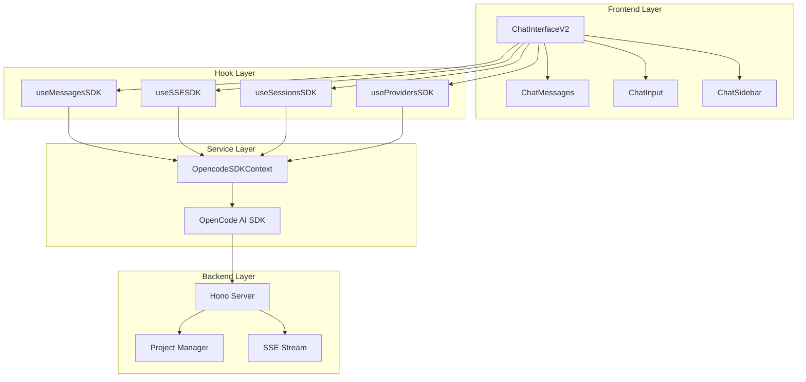
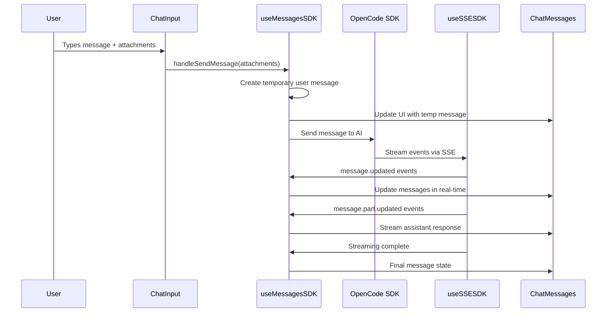
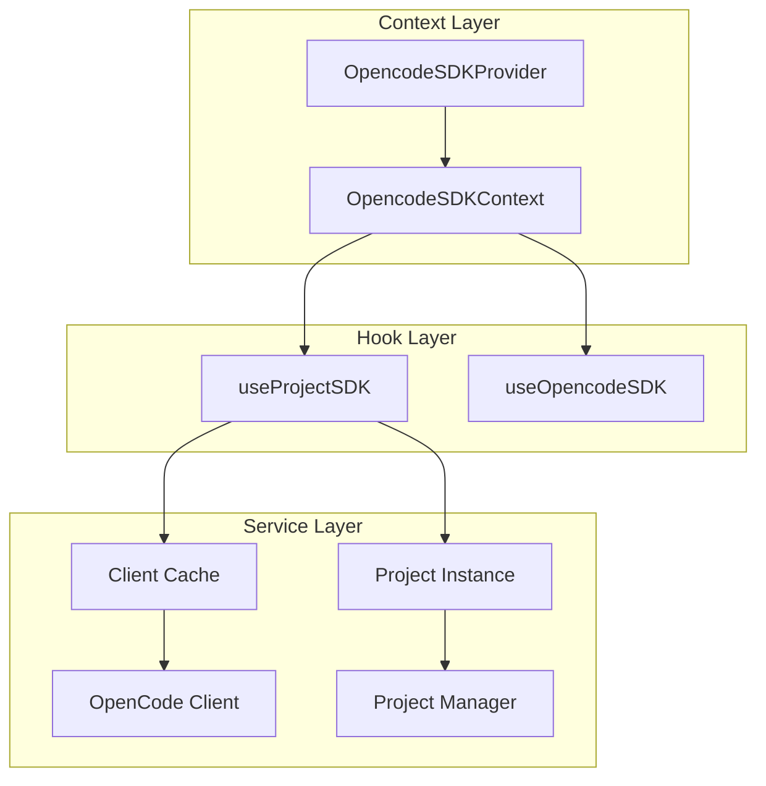
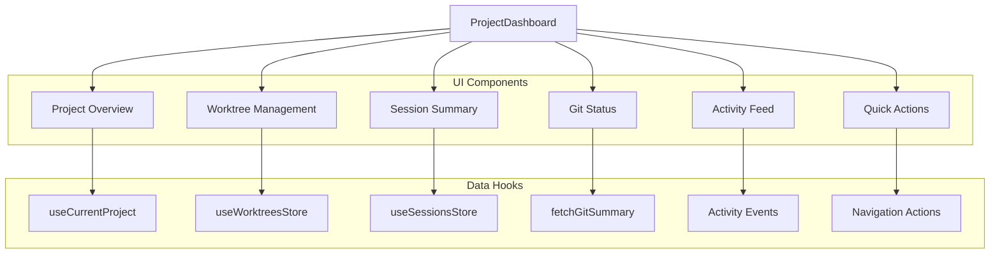

# OpenCode Web UI - Chat System & Streaming Architecture

## 1. Chat System Overview

The OpenCode Web UI implements a sophisticated real-time chat system that enables seamless AI-powered conversations with streaming responses, file attachments, and persistent message history. The system is built on a multi-layered architecture that separates concerns between UI components, state management, API integration, and real-time communication.

### 1.1 Core Components Architecture



### 1.2 Message Flow Architecture



## 2. Real-time Streaming Implementation

### 2.1 Server-Sent Events (SSE) Architecture

The application uses Server-Sent Events for real-time communication, implemented through the `useSSESDK` hook:

```typescript
// Core SSE subscription pattern
const result = await client.event.subscribe({
  signal: abortController.signal,
});

const stream = result?.stream;
for await (const event of stream) {
  handleEvent(event);
}
```

### 2.2 Event Types and Handling

| Event Type             | Purpose                           | Data Structure                                 |
| ---------------------- | --------------------------------- | ---------------------------------------------- |
| `message.updated`      | New message or message completion | `{ info: MessageResponse, sessionID: string }` |
| `message.part.updated` | Streaming content updates         | `{ part: Part, messageID: string }`            |
| `session.error`        | Error handling                    | `{ messageID?: string, error: Error }`         |

### 2.3 Streaming State Management

```typescript
// Streaming state flow in useMessagesSDK
const handleSendMessage = async (attachments?: FileAttachment[]) => {
  // 1. Create temporary user message for immediate UI feedback
  const tempUserMessage: MessageResponse = {
    id: `temp-${Date.now()}`,
    role: "user",
    parts: messageParts,
    _isTemporary: true
  };
  
  // 2. Update UI immediately
  setMessages(prev => [...prev, tempUserMessage]);
  setIsStreaming(true);
  
  // 3. Send to SDK
  await client.session.message.create({
    sessionId: currentSession.id,
    parts: sdkParts
  });
};
```

### 2.4 Message Part Streaming

The system handles different types of streaming content:

* **Text Parts**: Incremental text updates during AI response generation

* **Tool Calls**: Real-time display of function calls and results

* **File Parts**: Attachment processing and display

* **Reasoning Parts**: AI thinking process visualization

## 3. API Integration Patterns

### 3.1 SDK Context Architecture



### 3.2 Client Lifecycle Management

```typescript
// SDK client creation and caching
const getClient = useCallback(
  async (projectId: string, projectPath: string): Promise<OpencodeClient> => {
    // Check cache first
    const cached = clientCacheRef.current.get(projectId);
    if (cached) {
      setCurrentClient(cached);
      return cached;
    }

    // Create new client
    const client = await opencodeSDKService.getClient(projectId, projectPath);
    clientCacheRef.current.set(projectId, client);
    setCurrentClient(client);
    return client;
  },
  []
);
```

### 3.3 Project Management API Integration

#### Core Project Operations

```typescript
// Project CRUD operations
interface ProjectManagerClient {
  getProjects(): Promise<Project[]>
  getProject(id: string): Promise<Project>
  createProject(params: CreateProjectParams): Promise<Project>
  updateProject(id: string, params: UpdateProjectParams): Promise<Project>
  removeProject(id: string): Promise<{ success: boolean }>
  
  // Instance management
  startInstance(id: string): Promise<ProjectInstance>
  stopInstance(id: string): Promise<{ success: boolean }>
  getInstanceStatus(id: string): Promise<ProjectInfo>
}
```

#### API Request Pattern

```typescript
private async request<T>(path: string, options?: RequestInit): Promise<T> {
  const url = `${this.baseURL}${path}`;
  
  const response = await fetch(url, {
    ...options,
    headers: {
      "Content-Type": "application/json",
      ...options?.headers,
    },
  });
  
  if (!response.ok) {
    // Detailed error handling with request/response logging
    throw new Error(`HTTP ${response.status}: ${response.statusText}`);
  }
  
  return response.json();
}
```

### 3.4 State Synchronization Patterns

#### Zustand Store Integration

```typescript
// Projects store with persistence and optimistic updates
export const useProjectsStore = create<ProjectsStore>()(
  persist(
    immer((set, get) => ({
      // Optimistic updates for better UX
      selectProject: async (id: string) => {
        const project = projects.find(p => p.id === id);
        
        // Immediate UI update
        set(state => {
          state.currentProject = project;
        });
        
        // Background sync
        try {
          const updated = await client.getProject(id);
          set(state => {
            state.currentProject = updated;
          });
        } catch (error) {
          // Handle error while maintaining optimistic state
        }
      }
    }))
  )
);
```

## 4. Project Dashboard Implementation

### 4.1 Dashboard Component Architecture



### 4.2 Worktree Management System

#### Worktree State Management

```typescript
// Worktree store with Git integration
interface WorktreesState {
  worktreesByProject: Record<string, Worktree[]>
  loading: Record<string, boolean>
  error: Record<string, string | null>
}

// Worktree operations
const loadWorktrees = async (projectId: string) => {
  set(state => {
    state.loading[projectId] = true;
  });
  
  try {
    const worktrees = await client.getWorktrees(projectId);
    set(state => {
      state.worktreesByProject[projectId] = worktrees;
      state.loading[projectId] = false;
    });
  } catch (error) {
    set(state => {
      state.error[projectId] = error.message;
      state.loading[projectId] = false;
    });
  }
};
```

#### Worktree-Aware Routing

```typescript
// URL structure: /projects/:projectId/:worktreeId/...
const activeWorktree = useMemo(() => {
  if (resolvedWorktreeId === "default") {
    return {
      id: "default",
      path: currentProject?.path,
      title: `${currentProject?.name} (default)`
    };
  }
  return worktrees.find(w => w.id === resolvedWorktreeId);
}, [resolvedWorktreeId, currentProject, worktrees]);
```

### 4.3 Real-time Dashboard Updates

#### Git Status Integration

```typescript
// Real-time Git status updates
const loadGitSummary = async () => {
  try {
    const summary = await fetchGitSummary(projectId, worktreeId);
    setGitStatus(summary);
  } catch (error) {
    console.error("Git status update failed:", error);
  }
};

// Auto-refresh on worktree changes
useEffect(() => {
  if (projectId && activeWorktreePath) {
    loadGitSummary();
  }
}, [projectId, activeWorktreePath, resolvedWorktreeId]);
```

#### Session Activity Monitoring

```typescript
// Session statistics and recent activity
const sessions = useSessionsForProject(projectId, activeWorktreePath);
const recentSessions = useRecentSessions(projectId, 5, activeWorktreePath);

// Activity feed generation
const activityFeed = useMemo(() => {
  const events: ActivityEvent[] = [];
  
  // Add session creation events
  recentSessions.forEach(session => {
    events.push({
      id: `session-${session.id}`,
      type: "session_created",
      message: `New chat session: ${session.title}`,
      timestamp: session.createdAt
    });
  });
  
  // Add Git commit events
  gitStatus?.recentCommits?.forEach(commit => {
    events.push({
      id: `commit-${commit.hash}`,
      type: "git_commit",
      message: commit.message,
      timestamp: commit.date
    });
  });
  
  return events.sort((a, b) => 
    new Date(b.timestamp).getTime() - new Date(a.timestamp).getTime()
  );
}, [recentSessions, gitStatus]);
```

### 4.4 Dashboard Performance Optimizations

#### Selective Data Loading

```typescript
// Load data only when needed
useEffect(() => {
  if (!projectId) return;
  
  // Parallel data loading for better performance
  Promise.all([
    loadWorktrees(projectId),
    loadSessions(projectId, activeWorktreePath),
    loadGitSummary()
  ]).catch(error => {
    console.error("Dashboard data loading failed:", error);
  });
}, [projectId, activeWorktreePath]);
```

#### Memoized Computations

```typescript
// Expensive computations are memoized
const sortedWorktrees = useMemo(() => {
  if (!worktrees) return [];
  return [...worktrees].sort((a, b) => {
    if (a.id === "default") return -1;
    if (b.id === "default") return 1;
    return a.title.localeCompare(b.title);
  });
}, [worktrees]);

const additionalRecentCommits = useMemo(() => {
  if (!gitStatus?.recentCommits?.length) return [];
  
  const filtered = gitStatus.recentCommits.filter(
    commit => commit.hash !== gitStatus.lastCommit?.hash
  );
  return filtered.slice(0, 3);
}, [gitStatus]);
```

## 5. Error Handling and Resilience

### 5.1 SSE Connection Resilience

```typescript
// Automatic reconnection and cleanup
useEffect(() => {
  if (!client || !projectPath || !currentSession || instanceStatus !== "running") {
    return;
  }
  
  // Clean up previous connection
  if (abortControllerRef.current) {
    abortControllerRef.current.abort();
  }
  
  const abortController = new AbortController();
  abortControllerRef.current = abortController;
  
  // Subscribe with automatic cleanup
  subscribeToEvents().catch(error => {
    if (!abortController.signal.aborted) {
      console.warn("SSE connection failed:", error);
    }
  });
  
  return () => {
    abortController.abort();
  };
}, [client, projectPath, currentSession, instanceStatus]);
```

### 5.2 API Error Recovery

```typescript
// Graceful degradation for API failures
const loadMessages = useCallback(async (sessionId: string) => {
  try {
    let response = await client.session.messages({
      path: { id: sessionId },
      query: { directory: projectPath }
    });
    
    // Fallback strategy
    if (!response.data || response.data.length === 0) {
      response = await client.session.messages({ 
        path: { id: sessionId } 
      });
    }
    
    setMessages(response.data || []);
  } catch (error) {
    console.error("Message loading failed:", error);
    // UI remains functional with cached data
  }
}, [client, projectPath]);
```

## 6. Performance Considerations

### 6.1 Message Virtualization

For large chat histories, the system implements efficient rendering:

```typescript
// Conversation component handles automatic virtualization
<Conversation className="h-full flex-1">
  <ConversationContent className="mx-auto max-w-4xl space-y-4">
    {messages.map((message, index) => (
      <MessageComponent key={message.id || index} message={message} />
    ))}
  </ConversationContent>
</Conversation>
```

### 6.2 Optimistic Updates

Immediate UI feedback with background synchronization:

```typescript
// Temporary message for instant feedback
const tempUserMessage: MessageResponse = {
  id: `temp-${Date.now()}`,
  role: "user",
  parts: messageParts,
  _isTemporary: true
};

// UI updates immediately
setMessages(prev => [...prev, tempUserMessage]);

// Real message comes through SSE
// Temporary message is replaced when real one arrives
```

### 6.3 Efficient State Updates

```typescript
// Batch updates for better performance
setMessages(prev => {
  const existingIndex = prev.findIndex(m => m.id === info.id);
  if (existingIndex >= 0) {
    const updated = [...prev];
    updated[existingIndex] = { ...updated[existingIndex], ...info };
    return updated;
  }
  return [...prev, info];
});
```

This architecture provides a robust, scalable, an
