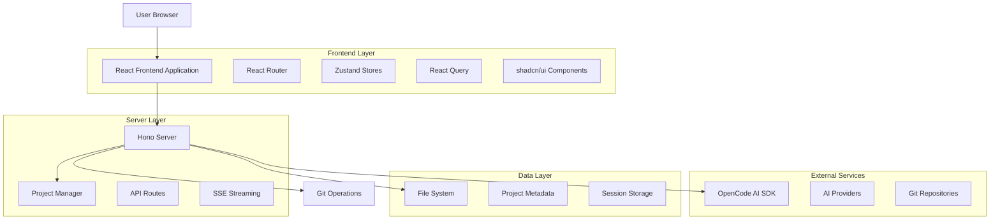
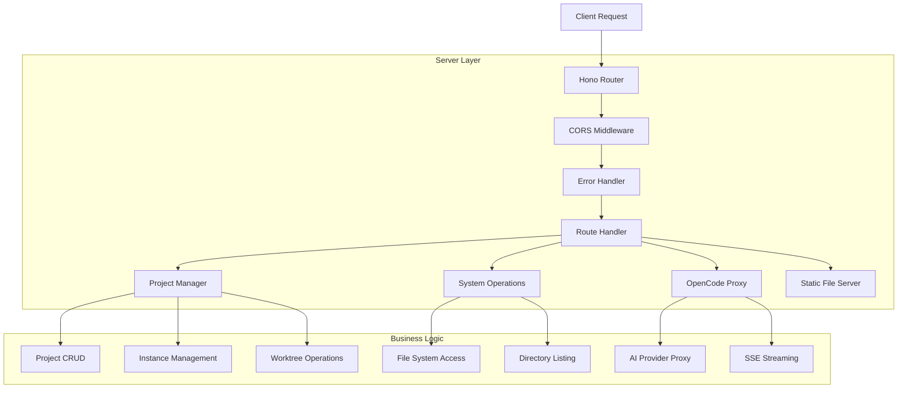
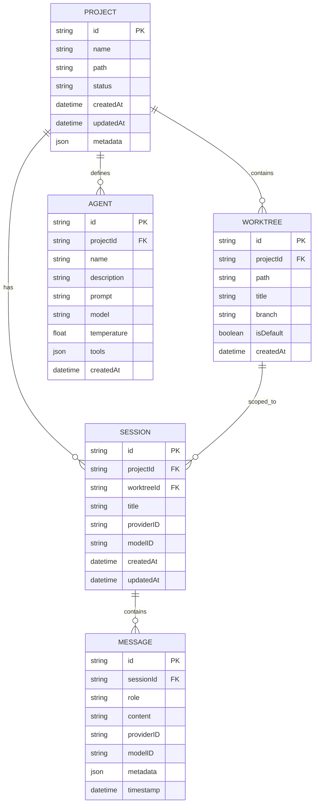

# OpenCode Web UI - Technical Architecture Document

## 1. Architecture Design



## 2. Technology Description

* Frontend: React\@18 + TypeScript + Vite + Tailwind CSS\@4

* Server: Hono\@4 + Node.js + TypeScript

* Build Tools: Rsbuild (client) + Rslib (server)

* UI Framework: shadcn/ui + Radix UI + Lucide React

* State Management: Zustand\@5 + React Query\@5

* Real-time: Server-Sent Events (SSE)

* Code Editor: Monaco Editor

* Terminal: xterm.js

* AI Integration: OpenCode AI SDK

* Testing: Rstest + Playwright + React Testing Library

## 3. Route Definitions

| Route                                                     | Purpose                                |
| --------------------------------------------------------- | -------------------------------------- |
| /                                                         | Project dashboard and list view        |
| /projects/:projectId/:worktreeId                          | Project overview for specific worktree |
| /projects/:projectId/:worktreeId/sessions                 | Session management and list            |
| /projects/:projectId/:worktreeId/sessions/:sessionId/chat | AI chat interface                      |
| /projects/:projectId/:worktreeId/git                      | Git operations and branch management   |
| /projects/:projectId/:worktreeId/github                   | GitHub integration features            |
| /projects/:projectId/:worktreeId/agents                   | Agent management and configuration     |
| /projects/:projectId/:worktreeId/files/\*                 | File browser and editor                |
| /projects/:projectId/:worktreeId/terminal                 | Terminal interface                     |
| /projects/:projectId/:worktreeId/settings                 | Project and worktree settings          |

## 4. API Definitions

### 4.1 Core API

**Health Check**

```
GET /api/health
```

Response:

| Param Name | Param Type | Description                |
| ---------- | ---------- | -------------------------- |
| status     | string     | Health status ("ok")       |
| timestamp  | string     | ISO timestamp              |
| projects   | number     | Number of managed projects |

Example:

```json
{
  "status": "ok",
  "timestamp": "2024-01-15T10:30:00Z",
  "projects": 5
}
```

**Project Management**

```
GET /api/projects
```

Response:

| Param Name | Param Type | Description              |
| ---------- | ---------- | ------------------------ |
| projects   | Project\[] | Array of project objects |

```
POST /api/projects
```

Request:

| Param Name | Param Type | isRequired | Description                        |
| ---------- | ---------- | ---------- | ---------------------------------- |
| name       | string     | true       | Project display name               |
| path       | string     | true       | Absolute path to project directory |

Response:

| Param Name | Param Type | Description          |
| ---------- | ---------- | -------------------- |
| id         | string     | Generated project ID |
| name       | string     | Project name         |
| path       | string     | Project path         |
| createdAt  | string     | Creation timestamp   |

**Project Operations**

```
POST /api/projects/:id/start
```

Response:

| Param Name | Param Type | Description            |
| ---------- | ---------- | ---------------------- |
| status     | string     | Operation status       |
| url        | string     | Backend URL if started |

```
GET /api/projects/:id/worktrees
```

Response:

| Param Name | Param Type  | Description            |
| ---------- | ----------- | ---------------------- |
| worktrees  | Worktree\[] | Array of Git worktrees |

**System Operations**

```
GET /api/system/home
```

Response:

| Param Name | Param Type | Description              |
| ---------- | ---------- | ------------------------ |
| path       | string     | User home directory path |

```
GET /api/system/list-directory?path={path}
```

Response:

| Param Name | Param Type        | Description            |
| ---------- | ----------------- | ---------------------- |
| path       | string            | Current directory path |
| parent     | string\|null      | Parent directory path  |
| entries    | DirectoryEntry\[] | Directory contents     |

## 5. Server Architecture Diagram



## 6. Data Model

### 6.1 Data Model Definition



### 6.2 Data Definition Language

**Project Storage (File-based JSON)**

```typescript
// Project metadata stored in project-manager.ts
interface Project {
  id: string
  name: string
  path: string
  status: 'stopped' | 'starting' | 'running' | 'error'
  createdAt: string
  updatedAt: string
  metadata?: {
    packageJson?: Record<string, unknown>
    gitInfo?: {
      branch: string
      remotes: string[]
    }
  }
}

// Worktree information
interface Worktree {
  id: string
  projectId: string
  path: string
  title: string
  branch?: string
  isDefault: boolean
  createdAt: string
}

// Session data structure
interface SessionInfo {
  id: string
  projectId: string
  worktreeId: string
  title: string
  providerID?: string
  modelID?: string
  createdAt: string
  updatedAt: string
}

// Message structure for chat
interface Message {
  id: string
  sessionId: string
  role: 'user' | 'assistant' | 'system'
  content: string
  providerID?: string
  modelID?: string
  metadata?: {
    toolCalls?: ToolCall[]
    streaming?: boolean
  }
  timestamp: string
}

// Agent configuration
interface Agent {
  id: string
  projectId: string
  name: string
  description: string
  mode: 'primary' | 'subagent'
  model: string
  temperature: number
  prompt: string
  tools: Record<string, boolean | string[]>
  createdAt: string
}
```

**Storage Implementation**

```typescript
// Projects stored in memory with file persistence
class ProjectManager {
  private projects: Map<string, Project> = new Map()
  private instances: Map<string, ProjectInstance> = new Map()
  
  // File-based persistence for project metadata
  private async saveProjects(): Promise<void>
  private async loadProjects(): Promise<void>
  
  // Instance management for OpenCode backend
  async startProject(projectId: string): Promise<ProjectInstance>
  async stopProject(projectId: string): Promise<void>
}

// Sessions and messages handled by OpenCode SDK
// Worktrees managed through Git operations
// Agents stored in opencode.json configuration
```

**Initial Data Setup**

```typescript
// Default project structure
const defaultProject: Partial<Project> = {
  status: 'stopped',
  metadata: {
    packageJson: {},
    gitInfo: {
      branch: 'main',
      remotes: []
    }
  }
}

// Default worktree (always exists)
const defaultWorktree: Omit<Worktree, 'projectId' | 'createdAt'> = {
  id: 'default',
  path: '', // Set to project path
  title: 'Default',
  isDefault: true
}
```

