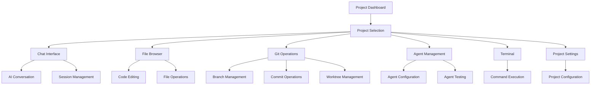

# OpenCode Web UI - Product Requirements Document

## 1. Product Overview

OpenCode Web UI is a modern web-based interface for managing multiple AI-powered development projects from a single browser application. It provides developers with an integrated workspace that combines project management, AI-assisted coding, Git operations, and file management capabilities.

The platform solves the challenge of managing multiple development projects while leveraging AI assistance for coding tasks. It targets software developers, development teams, and AI-assisted coding enthusiasts who need a centralized interface to manage their projects and interact with AI coding assistants.

The product aims to become the primary interface for AI-powered development workflows, enabling seamless project management and AI collaboration in software development.

## 2. Core Features

### 2.1 User Roles

| Role | Registration Method | Core Permissions |
|------|---------------------|------------------|
| Developer | Direct access (no registration required) | Full access to all project management, AI chat, Git operations, and file management features |
| Team Member | Shared workspace access | Can view and collaborate on shared projects, participate in AI chat sessions |

### 2.2 Feature Module

Our OpenCode Web UI consists of the following main pages:

1. **Project Dashboard**: project list, project creation, project status monitoring, worktree management
2. **Chat Interface**: AI conversation, message streaming, provider/model selection, session management
3. **Git Operations**: branch management, commit operations, worktree switching, repository status
4. **Agent Management**: agent creation, agent configuration, agent testing, custom prompt management
5. **File Browser**: directory navigation, file editing, file operations, Monaco editor integration
6. **Project Settings**: project configuration, worktree settings, integration management
7. **Terminal Interface**: command execution, real-time output, project-specific terminals

### 2.3 Page Details

| Page Name | Module Name | Feature description |
|-----------|-------------|---------------------|
| Project Dashboard | Project List | Display all projects with status indicators, creation timestamps, and quick actions |
| Project Dashboard | Project Creation | Add new projects via directory selection with auto-detection of project metadata |
| Project Dashboard | Instance Management | Start/stop project instances with real-time status monitoring |
| Project Dashboard | Worktree Overview | Manage Git worktrees for isolated development environments |
| Chat Interface | AI Conversation | Real-time chat with AI assistants supporting streaming responses and tool calls |
| Chat Interface | Session Management | Create, rename, delete chat sessions with persistent message history |
| Chat Interface | Provider Selection | Choose AI providers (Anthropic, OpenAI, etc.) and models dynamically |
| Chat Interface | Message History | Load and display conversation history with syntax highlighting |
| Git Operations | Branch Management | Create, switch, merge branches with visual branch representation |
| Git Operations | Commit Operations | Stage changes, create commits, view commit history with diff previews |
| Git Operations | Worktree Management | Create and manage Git worktrees for parallel development |
| Git Operations | Repository Status | Display working directory status, staged changes, and repository health |
| Agent Management | Agent Configuration | Create custom AI agents with specific prompts, models, and tool permissions |
| Agent Management | Agent Testing | Test agent responses and behavior in isolated environments |
| Agent Management | Prompt Management | Design and iterate on agent prompts with template support |
| File Browser | Directory Navigation | Browse project files and directories with tree view and breadcrumbs |
| File Browser | Code Editing | Edit files using Monaco editor with syntax highlighting and IntelliSense |
| File Browser | File Operations | Create, delete, rename files and directories with drag-and-drop support |
| Project Settings | Configuration | Manage project-specific settings, paths, and integration preferences |
| Project Settings | Worktree Settings | Configure worktree-specific settings and metadata |
| Terminal Interface | Command Execution | Execute shell commands within project context with real-time output |
| Terminal Interface | Session Management | Maintain persistent terminal sessions per project/worktree |

## 3. Core Process

**Developer Workflow:**
1. Developer accesses the application and views the project dashboard
2. Creates a new project by selecting a directory or opens an existing project
3. Navigates to the chat interface to start an AI-assisted coding session
4. Selects appropriate AI provider and model for the task
5. Engages in conversation with AI assistant, receiving streaming responses
6. Uses file browser to navigate and edit project files as needed
7. Performs Git operations to manage code changes and branches
8. Creates custom agents for specific development tasks
9. Uses terminal for command-line operations within project context
10. Manages multiple worktrees for parallel development streams

**Team Collaboration Flow:**
1. Team lead creates and configures project with appropriate settings
2. Team members access shared project through worktree management
3. Each member works in isolated worktrees while sharing AI chat sessions
4. Git operations are coordinated through the visual Git interface
5. Custom agents are shared and refined collaboratively

## 4. User Interface Design

### 4.1 Design Style

- **Primary Colors**: Modern dark theme with blue (#3b82f6) and purple (#8b5cf6) accents
- **Secondary Colors**: Neutral grays (#f8fafc, #64748b) with semantic colors (green for success, red for errors)
- **Button Style**: Rounded corners with subtle shadows, hover animations, and clear visual hierarchy
- **Font**: Inter font family with 14px base size, 16px for headings, monospace for code
- **Layout Style**: Sidebar-based navigation with collapsible panels, card-based content areas
- **Icons**: Lucide React icons with consistent 16px-20px sizing and semantic meaning

### 4.2 Page Design Overview

| Page Name | Module Name | UI Elements |
|-----------|-------------|-------------|
| Project Dashboard | Project List | Grid layout with project cards, status badges, action buttons, search/filter bar |
| Project Dashboard | Project Creation | Modal dialog with directory picker, form validation, progress indicators |
| Chat Interface | AI Conversation | Split-pane layout with message bubbles, streaming indicators, syntax highlighting |
| Chat Interface | Session Sidebar | Collapsible sidebar with session list, search, and management actions |
| Git Operations | Branch View | Tree visualization with branch status, merge indicators, and action buttons |
| Git Operations | Commit History | Timeline view with commit messages, author info, and diff previews |
| Agent Management | Agent Editor | Form-based interface with code editor for prompts, model selection dropdowns |
| File Browser | Directory Tree | Hierarchical tree view with icons, context menus, and drag-drop support |
| File Browser | Code Editor | Full-screen Monaco editor with tabs, minimap, and IntelliSense |
| Terminal Interface | Terminal Emulator | Full xterm.js integration with themes, search, and session management |

### 4.3 Responsiveness

The application is desktop-first with adaptive mobile support. The sidebar collapses on smaller screens, and touch interactions are optimized for tablet use. The interface maintains functionality across screen sizes while prioritizing desktop development workflows.